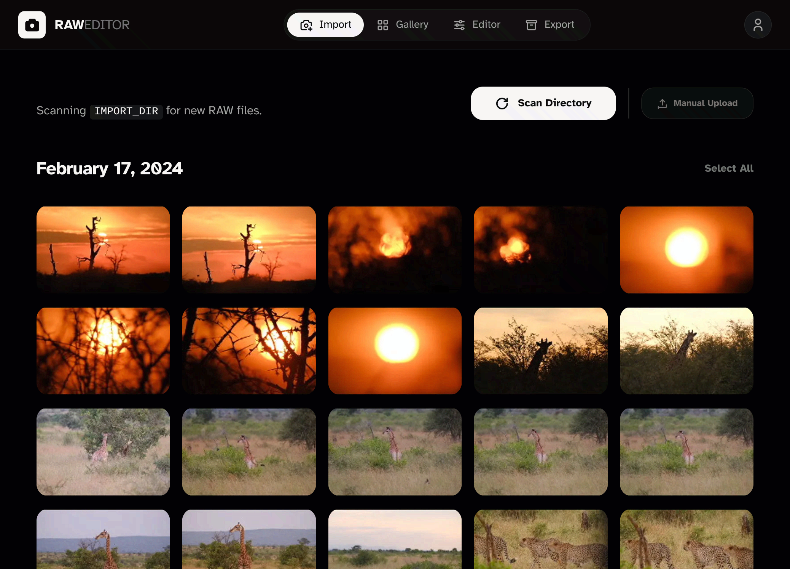
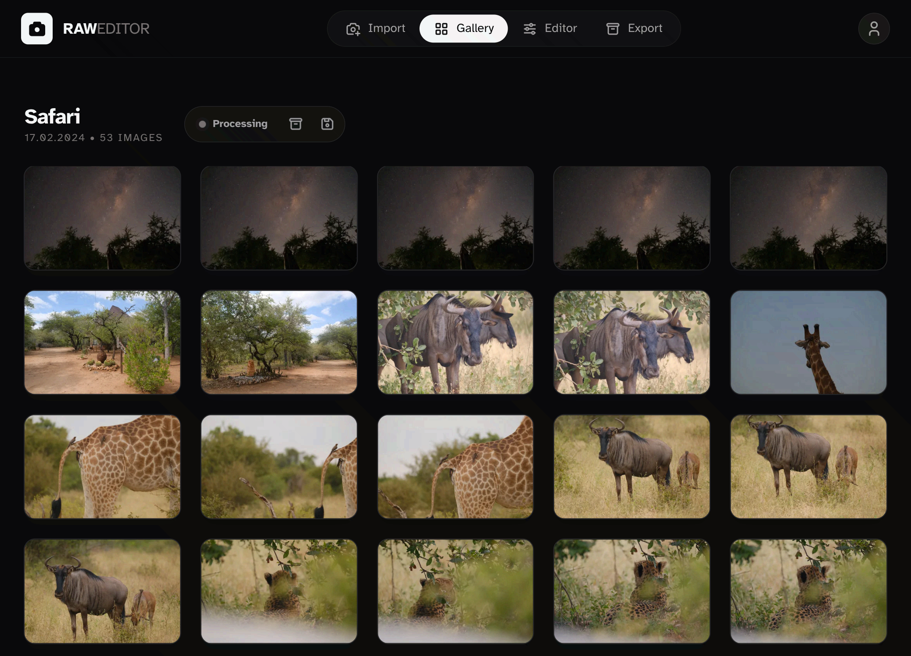
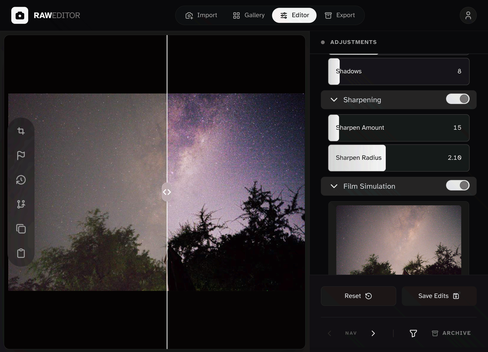
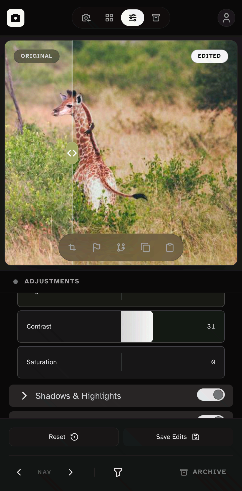
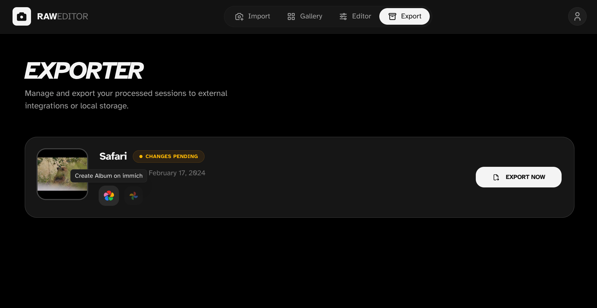

# RAW Editor

Web-based RAW photo editor, you can edit and export from anywhere.

## Highlights

- RAW import
- Web-based editing with versioned snapshots
- Touch-friendly UI
- Background import/export
- Export to external integrations (Immich, Google Photos)
- Docker-first setup for self-hosting

## Screenshots

### 1. Import


### 2. Gallery


### 3. Editor




### 4. Export


## Quick start

1) Download the compose file: [docker-compose.yml](https://raw.githubusercontent.com/poesterlin/raw-editor/main/docker-compose.selfhost.yml)

2) Create an empty env file:

This is where you can setup secrets for configuring the export integrations.

```bash
touch .env
```

3) Start the stack (app + Postgres):

```bash
docker compose up -d
```

4) [optional] Download Film Emulation Profiles
The editor can use the Hald CLUT pack for easy film emulations. Download the zip and unzip it to `./cluts`: http://rawtherapee.com/shared/HaldCLUT.zip

5) Open Port 4893

## Configuration

- Edit `docker-compose.yaml` for database and paths
- See `docs/CONFIGURATION.md` for environment variables

## Integrations

RAW Editor supports exporting to external photo management services.

### Immich

1) Get an **API Key** from your Immich user settings.
2) Add the following to your `.env`:
   - `IMMICH_BASE_URL`: Your Immich instance URL (e.g., `https://immich.example.com`)
   - `IMMICH_API_KEY`: Your generated API key

### Google Photos

1) Create a project in the [Google Cloud Console](https://console.cloud.google.com/).
2) Enable the **Photos Library API**.
3) Create an **OAuth 2.0 Client ID** (Type: Web Application).
4) Add `<HOST_DOMAIN>/api/auth/google/callback` (or your production domain) as a **Redirect URI**.
5) Add the following to your `.env`:
   - `GOOGLE_CLIENT_ID`
   - `GOOGLE_CLIENT_SECRET`

#### Token Persistence (Self-Hosting)

When you authenticate with Google, tokens are saved to `/app/data/google_tokens.json` inside the container. To persist this across container restarts, ensure you have the `data` volume mapped in your `docker-compose.yml`:

```yaml
services:
  editor:
    # ...
    volumes:
      - ./data:/app/data
```

## Roadmap

- [ ] User authentication
- [x] Undo/Redo functionality
- [ ] Processing notifications
- More editing tools
   - [ ] Black Point/White Point
   - [ ] Curves
   - [ ] Vibrance
   - [ ] ColorToning
   - [ ] HSV Equalizer
   - [ ] Lens corrections
- [ ] Automatic SD-card import
- [ ] Progressive loading for better quality previews

## License

See `LICENSE` for GPLv3 terms.
